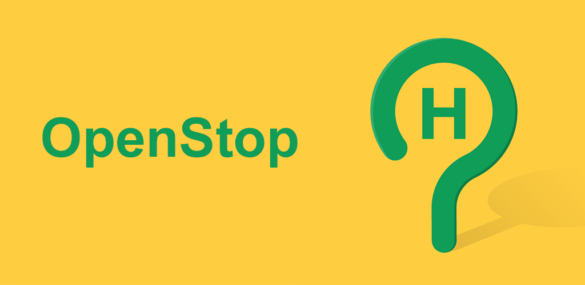
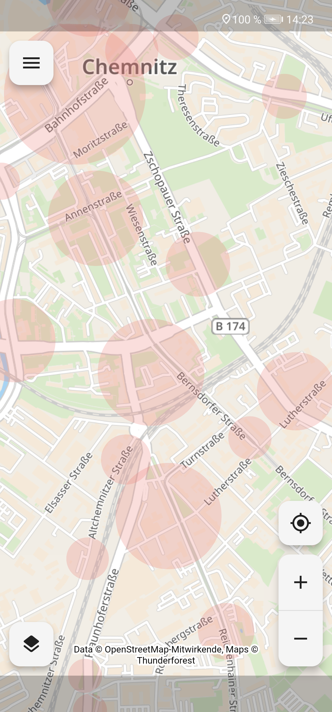
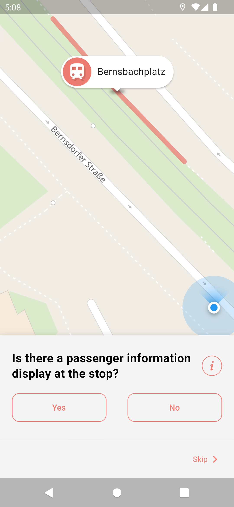
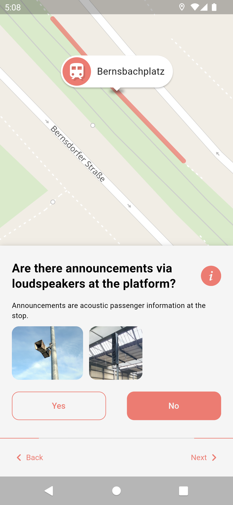
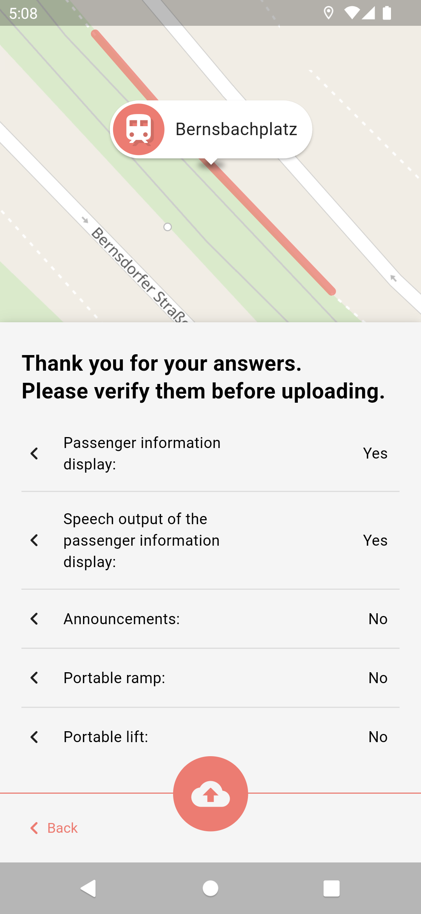
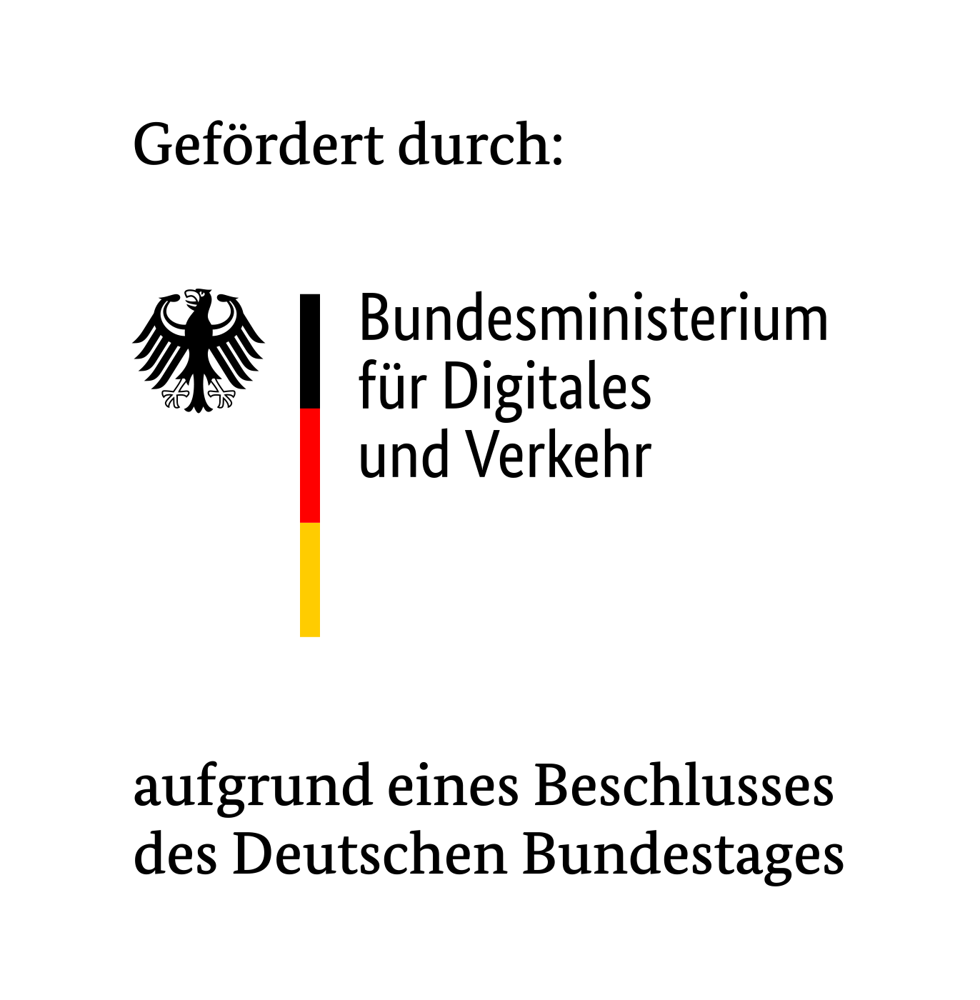

The goal of this app is to collect accessibility data for public transport stops in [OpenStreetMap](https://www.openstreetmap.org) so that everyone can benefit from it.
Due to the huge amount of public transport stops out there we want to encourage all citizen (experienced OSM users and newcomers) to help gathering this data. That's why we are developing this app that allows collecting the data in an easy, accessible and safe manner by asking simple questions. For deeper insight read  the [working principle](/docs/WORKING_PRINCIPLE.md) of the app.

The data shall be the foundation for better routing especially for impaired people and lead to a renovation of non accessible stops, as well as many other things we ourselves can't even imagine right now.

Thanks and happy mapping!

## Download

## Screenshots
   

## Contributing
We are always happy, if you not only want to help us mapping, but also want to directly participate in the project. You can either open issues for enhancement suggestions and bug reports or help us developing the app further. A good starting point for the latter is to read the [build instructions](/docs/BUILD.md) for the app.

## License
This app is released under the terms of the [GNU General Public License](/LICENSE).

## Funding
 

OpenStop is developed in the project [OPENER next](https://openernext.de), which is funded by the German Federal Ministry for Digital and Transport as part of the mFUND innovation initiative.

## Acknowledgement
Special thanks to Andy Allan ([@gravitystorm](https://github.com/gravitystorm/)) for granting us free access to the beautiful [Thunderforest](https://www.thunderforest.com/) map tiles.
