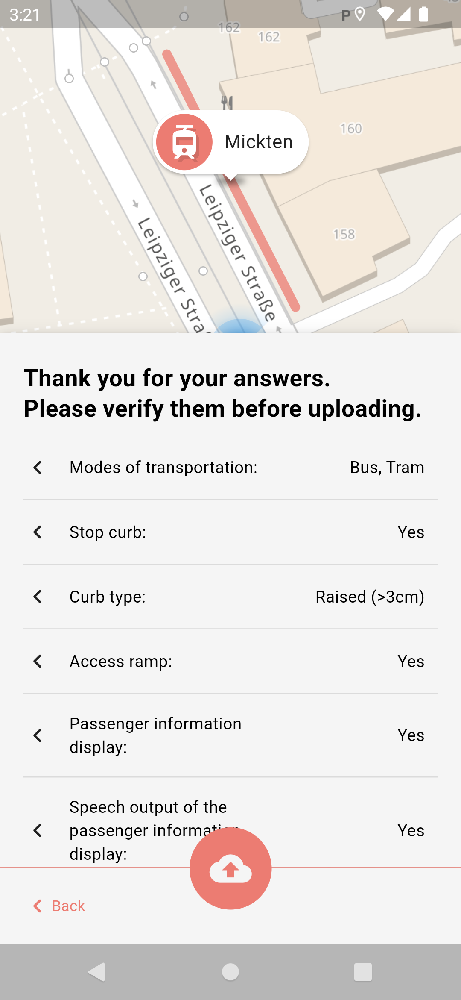

此应用程序的目标是收集 [OpenStreetMap](https://www.openstreetmap.org) 中公共交通站点的无障碍数据，以便每个人都能从中受益。
由于那里有大量的公共交通站点，我们希望鼓励所有公民（有经验的 OSM 用户和新人）帮助收集这些数据。这就是我们开发这款应用程序的原因，它可以通过提出简单的问题，以简单、可访问且安全的方式收集数据。如需更深入的了解，请阅读应用程序的[工作原理](/docs/WORKING_PRINCIPLE.md)。

这些数据将成为更好的路线的基础，特别是对于残障人士来说，并导致无法到达的车站的改造，以及我们自己现在无法想象的许多其他事情。

谢谢，祝您绘图愉快！

## Download

## Screenshots
    

## Contributing
如果您不仅想帮助我们绘制地图，而且还想直接参与该项目，我们总是很高兴。您可以提出问题以获取增强建议和错误报告，也可以帮助我们进一步开发应用程序。后者的一个很好的起点是阅读应用程序的[构建说明](/docs/BUILD.md)。

## License
此应用程序是根据 [GNU General Public License](/LICENSE) 发布的。

## Funding
 

OpenStop 由 [OPENER next](https://openernext.de) 项目所开发，该项目由德国联邦数字化和交通部资助，作为 mFUND 创新计划的一部分。

## Acknowledgement
特别感谢 Andy Allan ([@gravitystorm](https://github.com/gravitystorm/)) 允许我们免费试用优雅的 [Thunderforest](https://www.thunderforest.com/) 地图瓦片。
